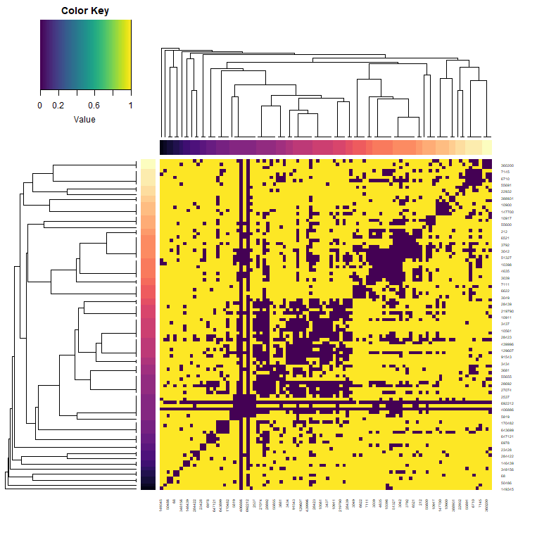
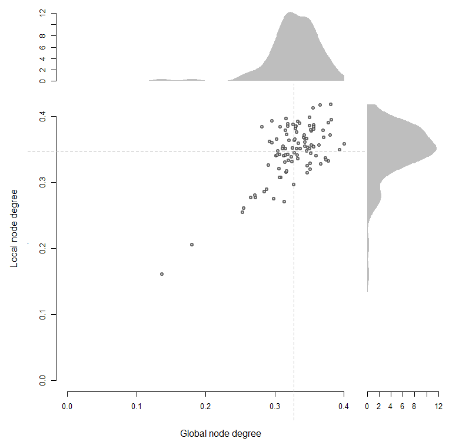

# OutDeCo 
*OutDeCo*: Outlier detection through co-expression. The purpose of this package is to assess genes - more specifically differentially expressed genes - with respect to their co-expression properties. 

# Package Overview
In this section we give an overview of the core functions and main features of the package. For usage and applications see the examples in the following sections. In addition, concise examples are included in the function documentation.

Gene networks are commonly used as a means of representing relationships between genes. 

 
# User Guide
## Using the package to run a differential expression analysis 

### 1. Expression data
To run, you need a read counts dataset.
Currently, we have not implemented any pre-processing steps, so please make sure that the data is
set up as a matrix, with columns as your individual samples, and rows as genes.
The row names should be labelled by their gene entrez IDs.
The columns should be labelled by their sample IDs.
The expression dataset should be placed in the variable: ``` counts ``` 

```{r load_data}
data(counts_data)
data(labels) 
```

### 2. Run a DE analysis *** SKIP THIS 
#### a. Using the wilcox.test
Let's peform a sex differential expression analysis. Our data has individuals from family trios and quads, so we have to first pick the samples we need. 
```{r eval=F}
groups <- as.numeric(labels$Sex) 
groups[labels$Family==1] <- 0
groups[labels$Relationship == "prb"] <- 0
```
We then run a basic differential expression, males versus females, and plot the resulting genes.
```{r}
deg <- calc_DE(counts_data, groups, "wilcox")
plot( deg$degs$log2_fc, -log10(deg$degs$pvals), 
      pch=19, bty="n", 
      xlab="log2 FC", ylab="-log10 p-vals" )
plot( log2(deg$degs$mean_cpm),  deg$degs$log2_fc,  
      pch=19, bty="n", 
      ylab="log2 FC", xlab="Average expression (log2 CPM + 1)")
```
 


#### b. Using other common methods 
Alternatively, we can run default versions of either DESeq2 or edgeR: 
```{r eval=FALSE}
deg <- calc_DE(counts_data, groups, "DESeq2")
plot( deg$degs$log2_fc, -log10(deg$degs$pvals), 
      pch=19, bty="n", 
      xlab="log2 FC", ylab="-log10 p-vals" )
plot( log2(deg$degs$mean_cpm),  deg$degs$log2_fc,  
      pch=19,  bty="n", 
      xlab="Average expression (log2 CPM + 1)", ylab="log2 FC" )
```
 

```{r}
deg <- calc_DE(counts_data, groups, "edgeR")
plot( deg$degs$log2_fc, -log10(deg$degs$pvals),  
      pch=19, bty="n", 
      xlab="log2 FC", ylab="-log10 p-vals" )
plot( log2(deg$degs$mean_cpm),  deg$degs$log2_fc,  
      pch=19 , bty="n",   
      xlab="Average expression (log2 CPM + 1)", ylab="log2 FC") 
```
 

Note, second variable in list is the regular output from either tool.
#### c. Other bespoke methods 
Or your own analysis, but making sure your DE results are formatted similarily. We've provided a function to do this but it might be buggy! For more detail, see the function guidelines. 
```{r eval=FALSE}
conditions <- groups
samples <- colnames(cpm)
col_data <- as.data.frame(cbind(samples, conditions))
colnames(col_data) <- c("samples", "conditions")
dds <- DESeq2::DESeqDataSetFromMatrix(countData = counts,
                                        colData = col_data,
                                         design = ~conditions)
dds <- DESeq2::DESeq(dds)
degs_input <- DESeq2::results(dds, contrast = c("conditions", "2", "0"))
deg <- reformat_degs(degs_input, method) 
```


## Using the package to assess a differentially expressed gene list
### 1. Getting co-expression networks for DE genes. 
#### a. From an expression experiment, we first run DE. 
```{r eval = FALSE}
deg_output <- calc_DE(counts_data, groups, "wilcox")
network_type <- 'generic'
sub_nets <- subset_network_hdf5(deg_output$degs, network_type, dir=GLOBAL_DIR)
```
This returns a sub-network object with our data and useful properties.  
#### b. Alternatively, we can extract the subnetwork from a gene list (here sampling 100 genes from the X chromosome). 
```{r eval = FALSE}
gene_list <- sample(  EGAD::attr.human$name[EGAD::attr.human$chr=="chrX"], 100 )
network_type <- 'generic'
sub_nets <- subset_network_hdf5_gene_list(gene_list, network_type, dir=GLOBAL_DIR)
```

With these list of DEGs or genes, we can view their co-expression profiles with the provided aggregate co-expression networks.  
### 2. Cluster genes
```{r}
# Extract data from the DE analysis 
deg_sig <- sub_nets$deg_sig
fc_sig  <- sub_nets$fc_sig
sub_net <- sub_nets$sub_net
node_degrees <-  sub_nets$node_degrees 
medK <-  as.numeric(sub_nets$median)

# Or if the analysis was from a gene list: 
sub_net <- sub_nets$sub_net
node_degrees <-  sub_nets$node_degrees 
medK <-  as.numeric(sub_nets$median)
```


Cluster and plot a heatmap of the binary co-expression sub-network using the ```cluster_coexp``` function.    
```{r}
clust_net <- list()  
# Extract data from the DE analysis 
clust_net[["down"]]  <- cluster_coexp( sub_net$down, medK = medK, flag_plot = TRUE )
clust_net[["up"]]  <- cluster_coexp( sub_net$up, medK = medK, flag_plot = FALSE )

# Extract data from the DE analysis 
clust_net[["genes"]]  <- cluster_coexp( sub_net, medK = medK, flag_plot = FALSE )

```


Or cluster and then use the ```plot_coexpression_heatmap``` function to visualize the underlying data.  
```{r}
clust_net[["down"]]  <- cluster_coexp( sub_net$down, medK = medK)
plot_coexpression_heatmap( sub_net$down, clust_net$down)
plot_network(sub_net$down, clust_net$down , medK)
```


### 3. Assess gene connectivity
You can look at the node degrees to get a sense of the global and local connectivities of the genes. 
```{r eval = FALSE}
plot_scatter(node_degrees$up[,1]/node_degrees$n_genes_total, 
                  node_degrees$up[,2]/node_degrees$n_genes_up, 
                  xlab="Global node degree", 
                  ylab="Local node degree" )  

plot_scatter(node_degrees$up[,1]/node_degrees$n_genes_total, 
                  node_degrees$up[,2]/node_degrees$n_genes_up, 
                  xlab="Global node degree", 
                  ylab="Local node degree", flag= "density")   
```
  

And view them or subset them by their clusters.
```{r eval = FALSE}
m <- match(clust_net$down$clusters$genes , rownames(sub_net$down))
plot_scatter(node_degrees$down[m,1]/node_degrees$n_genes_total, 
                  node_degrees$down[m,2]/node_degrees$n_genes_down, 
                  xlab="Global node degree", 
                  ylab="Local node degree", 
                  clusters = clust_net$down$clusters )  
```
 

### 4. Functional outliers 
Finally, we can assess the functional outliers within the sub-networks. These are the genes that are DE but do not show local co-expression. Here, we consider genes forming a module if there are more than 6 genes. We change this with the filt_min parameter. 
```{r eval=FALSE }
filt_min <- 6 
clust_size <- plyr::count(clust_net$down$clusters$labels )
clust_keep <-  clust_size[clust_size[,2] < filt_min ,1]
genes_keep <- !is.na(match( clust_net$down$clusters$labels, clust_keep))
plot_coexpression_heatmap(  sub_net$down, clust_net$down, filt=TRUE)
plot_network(sub_net$down, clust_net$down ,   medK)
```
  

Which genes were filtered away? It looks like genes on the Y chromosome, which makes sense in this context.  
```{r}
EGAD::attr.human[match( clust_net$down$clusters$genes[!genes_keep] , EGAD::attr.human$entrezID )  ,] 
```
 

And genes that remain? A variety of genes that could potentially be of interest.  
```{r}
EGAD::attr.human[match( clust_net$down$clusters$genes[genes_keep] , EGAD::attr.human$entrezID )  ,] 
```
 


### 5.  Gene set enrichment analysis
#### a. Overlap
```{r} 
 
data(go_slim_entrez)
data(go_voc)
filt <- colSums( go_slim_entrez ) < 5000 & colSums( go_slim_entrez ) >= 10
gene_list <- clust_net$up$clusters$genes[clust_net$up$order]
go_enrich <- gene_set_enrichment(gene_list, go_slim_entrez[filt,], go_voc) 
plot_gene_set_enrichment( go_enrich, gene_list, go_slim_entrez[filt,]) 


filt <- colSums( go_slim_entrez ) < 5000 & colSums( go_slim_entrez ) >= 10
gene_list <- clust_net$down$clusters$genes[clust_net$down$order]
go_enrich <- gene_set_enrichment(gene_list, go_slim_entrez[filt,], go_voc) 
plot_gene_set_enrichment( go_enrich, gene_list, go_slim_entrez[filt,]) 
```


#### b. Ranking
```{r} 
gene_rankings <- order( log10(deg$degs$pvals), abs(deg$degs$log2_fc)  ) 
names(gene_rankings) <- rownames(deg$degs)
gene_rankings_rev <- rank(max(gene_rankings) - gene_rankings)  
gene_sets <-  go_slim[filt,] 
  
  m <- match( rownames(gene_sets), names(gene_rankings_rev) )
  f.g = !is.na(m)
  f.r = m[f.g]
  gene_sets = gene_sets[f.g,]
  gene_rankings_rev = rank(gene_rankings_rev[f.r])


gene_set_aucs <- gene_set_enrichment_aucs(gene_sets, gene_rankings_rev) 
i = which.max(gene_set_aucs)  
 plot_roc(  gene_rankings_rev ~ gene_sets[,i], sub = round(gene_set_aucs[i],2), main=colnames(gene_sets)[i]) 
  
```


