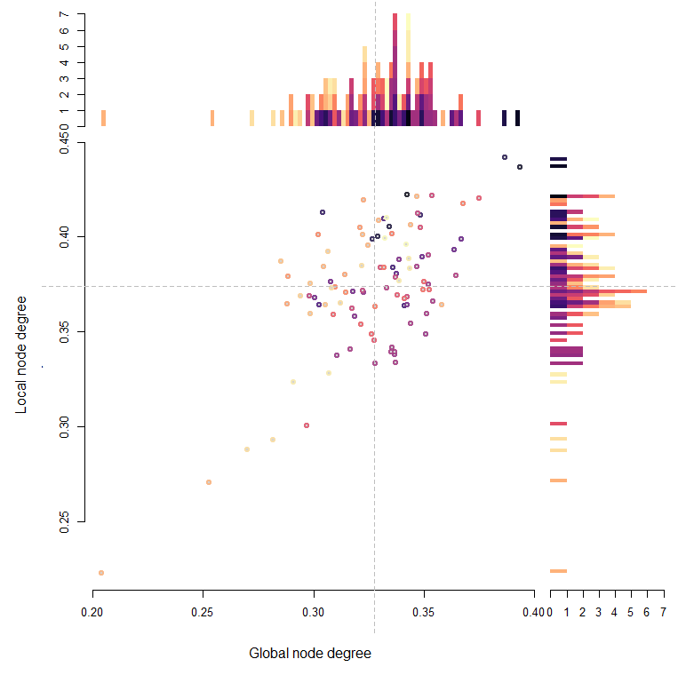
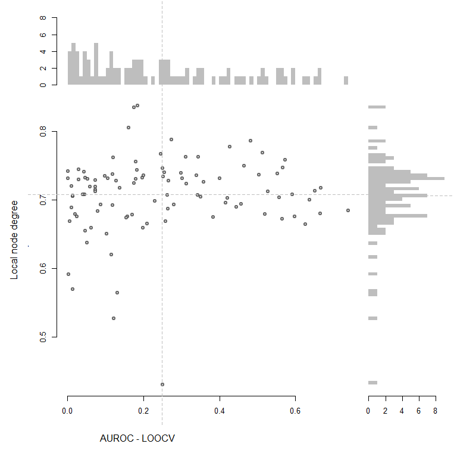
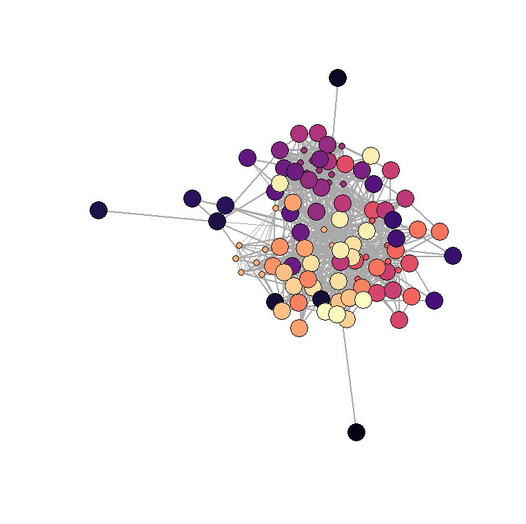

# OutDeCo 
*OutDeCo*: Outlier detection through co-expression. The purpose of this package is to assess genes - more specifically differentially expressed genes - with respect to their co-expression properties. 

# Introduction 
This manual provides an overview of the Bioconductor package *OutDeCo* for differential expression outlier analysis using co-expression. 

## What do we mean by "functional outliers"? 
Genes do not act alone. They participate in pathways (genetic interactions) or form complexes (physical interactions), each of which defines their function. An approach to assess their functions is to look to differential expression, where we assay the transcriptome and search for differences between conditions. Since one way to think of gene function is to consider disease, i.e., where systems break down or respond unusually to a perturbation, differential expression is a typical approach. This is usually followed by a gene set enrichment analysis to discover the common theme or function in the set of genes. 

However, this misses an interesting and potentially important counterfactual. What if the genes are no-longer functioning in their respective roles i.e., with their common interacting partners? Rather, it might be that genes acting uncharacteristically are of relevance to the dysfunction. We call these rogue actor genes “functional outliers”. In this scenario, a gene set enrichment analysis will miss these genes. 


## What you can do with this package
The functions implemented in *OutDeCo* can be applied to human gene expression data or a gene list of interest. An outline of the objects and workflow included in this package are in the **schematic**, which we go into more detail in the next sections. In particular, this package allows users to:
  * Run a differential expression (DE) analysis either through the typical case-control approach or a meta-analytic recurrence analysis 
  * Assess your DE results using gene co-expression properties 
  * Report a functional outlier assessment
  * Run a network connectivity analysis of DE results within a gene co-expression network


## What you need to get started

### Data 
A gene set of interest, typically from a differential expression analysis. Or an expression experiment with cases and controls. Or multiple expression experiments or gene lists to perform a meta-analysis. These genes will be assessed with respect to their co-expression properties from a selection of aggregate co-expression networks. Optionally, you can also provide your own gene network to assess the gene set(s) against. This can be one of protein-protein interaction networks, contact networks, etc.  

### System requirements
Although not necessary, this method runs best on a HPC with 20GB+ RAM. However, datasets of a few hundred samples and up to 30,000 genes can run on smaller CPUs, without the need to parallelise.  


## What is in this user guide
This manual contains a usage guide and descriptions of the package. 


## Citations
This software package was developed by the Gillis lab at Cold Spring Harbor Laboratory and the Ballouz lab at the Garvan Institute of Medical Research. 


## How to get help
Ask us! Please reach out. 


## Installation
To install this package, start R and enter

```{r, eval=FALSE}
if (!require("BiocManager"))
    install.packages("BiocManager")
BiocManager::install("OutDeCo", version = "devel")
```

To view this documentation in R, enter
```{r, eval=FALSE}
browseVignettes("OutDeCo")
```

Alternatively, use devtools for the development version. 
```{r , eval=FALSE}
# install.packages("devtools")
devtools::install_github("sarbal/OutDeCo")
```


# Package Overview
In this section we give an overview of the core functions and main features of the package. For usage and applications see the examples in the following sections. In addition, concise examples are included in the function documentation.

Gene networks are commonly used as a means of representing relationships between genes. 

 
# User Guide
## Using the package to run a differential expression analysis 

### 1. Expression data
To run, you need a read counts dataset.
Currently, we have not implemented any pre-processing steps, so please make sure that the data is
set up as a matrix, with columns as your individual samples, and rows as genes.
The row names should be labelled by their gene entrez IDs.
The columns should be labelled by their sample IDs.
The expression dataset should be placed in the variable: ``` counts ``` 

```{r load_data}
data(counts_data)
data(labels) 
```

### 2. Run a DE analysis 
#### a. Using the wilcox.test
```{r eval=F}
# Let's peform a sex differential expression analysis 
groups <- as.numeric(labels$Sex) 
# We ignore family 1, and remove the probands 
groups[labels$Family==1] <- 0
groups[labels$Relationship == "prb"] <- 0

# We run a basic DE
deg <- calc_DE(counts_data, groups, "wilcox")
plot( deg$degs$log2_fc, -log10(deg$degs$pvals), 
      pch=19, bty="n", 
      xlab="log2 FC", ylab="-log10 p-vals" )
plot( log2(deg$degs$mean_cpm),  deg$degs$log2_fc,  
      pch=19, bty="n", 
      ylab="log2 FC", xlab="Average expression (log2 CPM + 1)")
```
 


#### b. Using other common methods 
Alternatively, you can rundefault versions of either DESeq2 or edgeR: 
```{r eval=FALSE}
deg <- calc_DE(counts_data, groups, "DESeq2")
plot( deg$degs$log2_fc, -log10(deg$degs$pvals), 
      pch=19, bty="n", 
      xlab="log2 FC", ylab="-log10 p-vals" )
plot( log2(deg$degs$mean_cpm),  deg$degs$log2_fc,  
      pch=19,  bty="n", 
      xlab="Average expression (log2 CPM + 1)", ylab="log2 FC" )
```
 
```{r{
deg <- calc_DE(counts_data, groups, "edgeR")
plot( deg$degs$log2_fc, -log10(deg$degs$pvals),  
      pch=19, bty="n", 
      xlab="log2 FC", ylab="-log10 p-vals" )
plot( log2(deg$degs$mean_cpm),  deg$degs$log2_fc,  
      pch=19 , bty="n",   
      xlab="Average expression (log2 CPM + 1)", ylab="log2 FC") 
```
 

Note, second variable in list is the regular output from either tool.
#### c. Other bespoke methods 
Or your own analysis, but making sure your DE results are formatted similarily. We've provided a function to do this but it might be buggy! For more detail, see the function guidelines. 
```{r eval=FALSE}
conditions <- groups
samples <- colnames(cpm)
col_data <- as.data.frame(cbind(samples, conditions))
colnames(col_data) <- c("samples", "conditions")
dds <- DESeq2::DESeqDataSetFromMatrix(countData = counts,
                                        colData = col_data,
                                         design = ~conditions)
dds <- DESeq2::DESeq(dds)
degs_input <- DESeq2::results(dds, contrast = c("conditions", "2", "0"))
deg <- reformat_degs(degs_input, method) 
```

## Using the package to assess a differentially expressed gene list
### 1. Getting co-expression networks for DE genes from an expression dataset   
```{r eval = FALSE}
deg_output <- calc_DE(counts_data, groups, "wilcox")
network_type <- 'generic'
sub_nets <- subset_network_hdf5(deg_output$degs, network_type, dir=GLOBAL_DIR)
```

## Using the package to assess a differentially expressed gene list

### 1. Getting co-expression networks for DE genes from an expression dataset   
```{r eval = FALSE}
deg_output <- calc_DE(counts_data, groups, "wilcox")
network_type <- 'generic'
sub_nets <- subset_network_hdf5(deg_output$degs, network_type, dir=GLOBAL_DIR)
```

### 2. Cluster genes and assess modules 
```{r eval = FALSE}
clust_net = list()  
deg_sig <- sub_nets$deg_sig
fc_sig  <- sub_nets$fc_sig
sub_net <- sub_nets$sub_net
node_degrees <-  sub_nets$node_degrees 
medK <-  as.numeric(sub_nets$median)
# Cluster and plot a heatmap of the co-expression sub-network    
clust_net[["up"]]  <- cluster_coexp( sub_net$up, medK = medK, flag_plot = TRUE )

# Cluster and then plot
clust_net[["down"]]  <- cluster_coexp( sub_net$down)
plot_coexpression_heatmap( sub_net$down, clust_net$down)
```
 

You can look at the node degrees to get a sense of the global/local connectivities of the genes. 
```{r eval = FALSE}
plot_scatter(node_degrees$up[,1]/node_degrees$n_genes_total, 
                  node_degrees$up[,2]/node_degrees$n_genes_up, 
                  xlab="Global node degree", 
                  ylab="Local node degree" )  

plot_scatter(node_degrees$up[,1]/node_degrees$n_genes_total, 
                  node_degrees$up[,2]/node_degrees$n_genes_up, 
                  xlab="Global node degree", 
                  ylab="Local node degree", flag= "density")   
```
  

Or by cluster (colored) 
```{r eval = FALSE}
m <- match(clust_net$down$clusters$genes , rownames(sub_net$down))
plot_scatter(node_degrees$down[m,1]/node_degrees$n_genes_total, 
                  node_degrees$down[m,2]/node_degrees$n_genes_down, 
                  xlab="Global node degree", 
                  ylab="Local node degree", 
                  clusters = clust_net$down$clusters )  
```
 


Alternatively, we can assess the genes using their average connectivity properties in the network.
For this, we run a neighbor-voting algorithm (in the EGAD? package). 
```{r}
gene_sets <- matrix(0, nrow= dim(deg_sub)[1], ncol = 2 )
colnames(gene_sets) <- c("up", "down") 
rownames(gene_sets) <- rownames(deg_sub) 
gene_sets[deg_sig$up,1] <- 1 
gene_sets[deg_sig$down,2] <- 1 

network <- rhdf5::h5read("~/workspace/data/agg_coexp/generic.occr.net.h5", "net" )
genes <- rhdf5::h5read("~/workspace/data/agg_coexp/generic.genes.h5", "genes" )
colnames(network) = genes[,1]
rownames(network) = genes[,1]

loocv <- list() 
loocv[["up"]]   <- neighbor_voting_loocv( gene_sets[,1], network)
loocv[["down"]] <- neighbor_voting_loocv( gene_sets[,2], network)

m <- match(clust_net$down$clusters[,1] ,  rownames(loocv$down) )
plot_scatter(loocv$down[m,1], 
                  loocv$down[m,3], 
                  xlab="AUROC - LOOCV", 
                  ylab="Local node degree")  

m <- match(clust_net$up$clusters[,1] ,  rownames(loocv$up) )
plot_scatter(loocv$up[m,1], loocv$up[m,2], 
                  clusters = clust_net$up$clusters,
                  xlab="AUROC - LOOCV", 
                  ylab="Global node degree")  
```
  

Finally, we can assess the functional outliers within the results. These are the genes that are DE but do not show local co-expression. 
```{r eval=FALSE }
filt_min <-6 
clust_size <- plyr::count(clust_net$down$clusters$labels )
clust_keep <-  clust_size[clust_size[,2] < filt_min ,1]
genes_keep <- !is.na(match( clust_net$down$clusters$labels, clust_keep))

plot_coexpression_heatmap(  sub_net$down, clust_net$down, filt=TRUE)
plot_network(sub_net$down, clust_net$down , 1 - medK)
```
  

Which genes were filtered away? It looks like genes on the Y chromosome, which makes sense in this context.  
```{r}
EGAD::attr.human[match( clust_net$down$clusters$genes[!genes_keep] , EGAD::attr.human$entrezID )  ,] 
```
 

And genes that remain? A variety of genes that could potentially be of interest.  
```{r}
EGAD::attr.human[match( clust_net$down$clusters$genes[genes_keep] , EGAD::attr.human$entrezID )  ,] 
```
 

## Using the package to run a recurrence analysis
We can run the co-expression analyss in a meta-analytic framework. Here, we take multiple DE lists and use their recurrent DE properties. This method allows us to assess the prior probabilities of DEGs along with their co-expression properties. 

### 1. Collecting DE sets    
One option is to use other databases to perform a meta-analysis. You will need either multiple expression experiments or multiple differentially expressed gene (DEGs) lists. 
As studies are variable and samples may overlap, this is best done in a curated manner.
We have three example disease sets for your persual. Here we show a meta-analysis of Parkinson's disease.  
First load the data. In this example, we will load the sets of DEGs. For more info on how to do this, see the **notes**. 
```{r}
load("../out_test/junk/pd.DE.Rdata")
```
This file has two large matrices, genes by study, one with downregulated genes, and one with the upregulated genes. We analyze them independently. 


### 2. Calculating recurrence 
These are the X studies and the number of genes that were significantly upregulated in each.
```{r}
n_studies <- dim(genes.down)[2]
studies <- colnames(genes.down)
bp <- barplot(colSums(genes.down) , horiz = TRUE, 
              xlab = "Number of downregulated DEGs", 
              names = FALSE, col=inferno(n_studies), border=NA, space = 0)
text(1000, bp, studies)
subgenesets <- (genes.down[fg,])*1
```
 
 
To find gene-level recurrence, we simply sum the rows, and permute to calculate the signficance (or use a bionomial test).  
```{r}
fdrs <- calc_fdrs_recur( subgenesets )
fdrs_bin <- calc_binom_recur(subgenesets)
recur <- rowSums(subgenesets, na.rm=T)
plot_recurrence( subgenesets, fdrs, n_studies, flag_plot = "hist") 
plot_recurrence( subgenesets, fdrs, n_studies, flag_plot = "heat")
plot_recurrence( subgenesets, fdrs, n_studies, flag_plot = "venn")
```
    

Note, a maximum of 7 studies can be used in a venn diagram, so if the number of studies exceeds this, a random sample of studies are shown. 

### 3. Assessing enrichment 
Next, we look for pathway enrichment, and pathway-level recurrence. 
```{r eval=FALSE}
n_studies <- dim(subgenesets)[2]
studies <- colnames(subgenesets)
annotations <- EGAD::make_annotations(GO.human[,c(1,3)], (unique(GO.human[,1])), go.slim[ff,1])
go.enrich <-  lapply(1:n_studies, function(i) 
                     gene_set_enrichment( names(which(subgenesets[,i]==1)), 
                                          annotations, 
                                          go.slim[ff,1:2]))
paths <-  sapply(1:n_studies, function(i) (go.enrich[[i]]$padj<0.05)*1 )
paths.padj <-  sapply(1:n_studies, function(i) (go.enrich[[i]]$padj) )
rownames(paths) <-  go.enrich[[1]][,1]
rownames(paths.padj) <- go.enrich[[1]][,1]
colnames(paths) <- studies
colnames(paths.padj) <- studies


f = rowSums( paths) > 1
sigtemp= paths
sigtemp[sigtemp==1] = "*"
sigtemp[sigtemp==0] = ""

heatmap.2( -log10(t(paths.padj[f,])), Colv=F, Rowv=F, 
           col=cols9, cexRow = 0.7,  
           cellnote=t(sigtemp[f,]), 
           notecol="black", 
           notecex=2, 
           keysize=1, 
           key.xlab="-log10 adjusted P-value", 
           key.title="Enrichment", trace="none", density="none" )
```
 

We can run a pathway recurrence analysis too. 
```{r}
fdrs_paths  <- calc_fdrs_recur( paths )
plot_recurrence( paths, fdrs_paths, n_studies, flag_plot = "hist") 
plot_recurrence( paths, fdrs_paths, n_studies, flag_plot = "heat") 
```

 

Here, we find a few GO terms that are recurrent across the studies, all related to vesicle-mediated transport, very broad (and large) groups. 


### 4. Assessing recurrent genes 
We can then look at the enrichment of the recurrent genes. Genes that recur 4 or more times are significant. 
```{r eval=FALSE}
n_max_recur <-  max(recur)
go.enrich.recur <- lapply(1:n_max_recur, function(i) 
                          gene_set_enrichment( names(recur[recur>(i-1)]), 
                                               annotations, 
                                               go.slim[ff,1:2]))
pathsrec      <- sapply(1:n_max_recur, function(i) (go.enrich.recur[[i]]$padj<0.05)*1 )
pathsrec.padj <- sapply(1:n_max_recur, function(i) go.enrich.recur[[i]]$padj )
rownames(pathsrec)      <- go.enrich.recur[[1]][,1]
rownames(pathsrec.padj) <- go.enrich.recur[[1]][,1]
heatmap.2( -log10(t(pathsrec.padj[f,])), Colv=F, Rowv=F, 
           col=cols9, cexRow = 0.7,   
           notecol="black", 
           notecex=2, 
           keysize=1, 
           key.xlab="-log10 adjusted P-value", 
           key.title="Enrichment", trace="none", density="none" )
```

Genes that recur 4 or more times (~ genes) are enriched for vesicle-mediated terms. These overlap with the recurrently enriched pathways. 

```{r}
path_lists <- list( names(which((pathsrec[,4]) > 0 )), 
                    names(which( rowSums(paths) >= fdrs_paths$Pt ))) 
venn::venn (path_lists,
         zcolor= viridis(3), col=NA,
         snames=c("Recurrently \n enriched\n pathways", "Pathways enriched \n from recurrent genes"), 
         box = FALSE,
         ilcs = 1, sncs = 1.5)

path_overlap <-  intersect(path_lists[[1]], path_lists[[2]])  
```


### 5. Assessing recurrent genes and their co-expresssion 
#### a. Filtering by individual study
For every study, we can take their DEGs and run a co-expression filtering of the genes that are commonly co-expressed.
```{r}
network_type <- "generic"
load(file="../out_test/down_median_asdist.Rdata" ) 
#res.down <- run_filtering(  subgenesets, "down", network_type, outputflag = FALSE )
pre_post_mat <- get_recur_mat( cbind(res.down$Recurrence_filtered, res.down$Recurrence)  )
plot_2D_hist(pre_post_mat, 
              res.down$FDRs$Pt, res.down$FDRs_filtered$Pt, 
              col=recur_cols, 
              xlab="Gene recurrence", ylab="Outlier gene recurrence")
```


This shows genes that are recurrent but not commonly co-expressed in the network (top quadrant). 


We can repeat this analysis on other networks (here brain and blood aggregates). 
```{r}
network_type <- "brain"
load(file="../out_test/brain_down_median_asdist.Rdata" ) 

#res.brain <- run_filtering( subgenesets, "down", network_type, outputflag = FALSE )
pre_post_mat <- get_recur_mat( cbind(res.brain$Recurrence_filtered, res.brain$Recurrence)  )
plot_2D_hist(pre_post_mat, 
              res.brain$FDRs$Pt, res.brain$FDRs_filtered$Pt, 
              col=recur_cols, 
              xlab="Gene recurrence", ylab="Outlier gene recurrence")

network_type <- "blood"
load(file="..//out_test/blood_down_median_asdist.Rdata" ) 
#res.blood <- run_filtering( subgenesets, "down", network_type, outputflag = FALSE )
pre_post_mat <- get_recur_mat( cbind(res.blood$Recurrence_filtered, res.blood$Recurrence)  )
plot_2D_hist(pre_post_mat, 
              res.blood$FDRs$Pt, res.blood$FDRs_filtered$Pt, 
              col=recur_cols, 
              xlab="Gene recurrence", ylab="Outlier gene recurrence")
```
The outlier analysis shifts, with our set of genes showing co-expression in the brain and being filtered away. However, most genes remain recurrent (as outliers) in the blood. 
 


#### b. Filtering on the recurrent set 
```{r}
load("../out_test/junk/recur_example.Rdata") 
filt_min <- 6 
gene_list = names(recur[recur>=fdrs$Pt]  )  
gene_list_entrez <- EGAD::attr.human$entrezID[match(gene_list, EGAD::attr.human$name) ] 
network_type = "generic"
# sub_nets <- subset_network_hdf5_gene_list(gene_list_entrez , "generic", dir=GLOBAL_DIR)
clust_net <- cluster_coexp(  sub_nets$sub_net$genes, medK = as.numeric(sub_nets$median ) )
clust_size <- plyr::count(clust_net$clusters$labels )
clust_keep <-  clust_size[clust_size[,2] < filt_min ,1]
genes_keep <- !is.na(match( clust_net$clusters$labels, clust_keep))
plot_coexpression_heatmap(  clust_net$distance_matrix, clust_net, filt=TRUE)
plot_network( sub_nets$sub_net$genes, clust_net , 1 - as.numeric(sub_nets$median ))
```


## Using the package to assess gene lists or with other networks
### 1. Assessing a gene list and their co-expresssion 
```{r}
# Change to data example 
load("out_test/junk/ASD/asd_gene_sets.Rdata")
load("out_test/junk/ASD/asd_example_data.Rdata")
# 
filt_min <- 6 # Adjust/change  
gene_list <- rownames(asd.genes.tally)[asd.genes.tally[,17]==1]   
gene_list_entrez <- EGAD::attr.human$entrezID[match(gene_list, EGAD::attr.human$name) ] 
network_type = "generic"
# This takes some time, so pre-loading it instead 
# sub_nets <- subset_network_hdf5_gene_list(gene_list_entrez , "generic", dir=GLOBAL_DIR)
clust_net <- cluster_coexp(  sub_nets$sub_net$genes, medK = as.numeric(sub_nets$median ) )
clust_size <- plyr::count(clust_net$clusters$labels )
clust_keep <-  clust_size[clust_size[,2] < filt_min ,1]
genes_keep <- !is.na(match( clust_net$clusters$labels, clust_keep))
plot_coexpression_heatmap(  sub_nets$sub_net$genes, clust_net, filt=TRUE)
plot_network( sub_nets$sub_net$genes, clust_net , 1 - as.numeric(sub_nets$median ))
```


### 2. Assessing a gene list and their PPIN  
```{r}
# Change to data example 
load("../out_test/junk/ASD/asd_gene_sets.Rdata")
load("../out_test/junk/ASD/asd_example_data.Rdata")
# 
filt_min <- 6 # Adjust/change  
gene_list <- rownames(asd.genes.tally)[asd.genes.tally[,17]==1]   
gene_list_entrez <- EGAD::attr.human$entrezID[match(gene_list, EGAD::attr.human$name) ] 
network_type = "generic"
# This takes some time, so pre-loading it instead 
# sub_nets <- subset_network_hdf5_gene_list(gene_list_entrez , "generic", dir=GLOBAL_DIR)
clust_net <- cluster_coexp(  sub_nets$sub_net$genes, medK = as.numeric(sub_nets$median ) )
clust_size <- plyr::count(clust_net$clusters$labels )
clust_keep <-  clust_size[clust_size[,2] < filt_min ,1]
genes_keep <- !is.na(match( clust_net$clusters$labels, clust_keep))
plot_coexpression_heatmap(  sub_nets$sub_net$genes, clust_net, filt=TRUE)
plot_network( sub_nets$sub_net$genes, clust_net , 1 - as.numeric(sub_nets$median ))
```

# Acknowledgements

