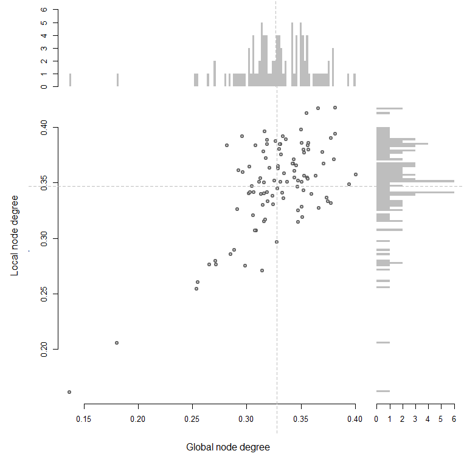
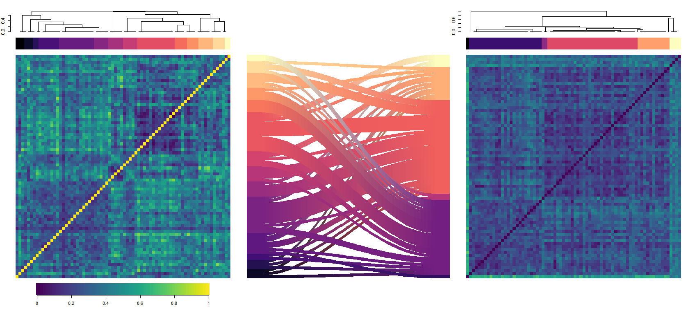

# OutDeCo 
*OutDeCo*: Outlier detection through co-expression. The purpose of this package is to assess genes - more specifically differentially expressed genes - with respect to their co-expression properties. 

# Package Overview
In this section we give an overview of the core functions and main features of the package. For usage and applications see the examples in the following sections. In addition, concise examples are included in the function documentation.

Gene networks are commonly used as a means of representing relationships between genes. 

 
# User Guide
## Using the package to run a differential expression analysis 

### 1. Expression data
To run, you need a read counts dataset.
Currently, we have not implemented any pre-processing steps, so please make sure that the data is
set up as a matrix, with columns as your individual samples, and rows as genes.
The row names should be labelled by their gene entrez IDs.
The columns should be labelled by their sample IDs.
The expression dataset should be placed in the variable: ``` counts ``` 

```{r load_data}
data(counts_data)
data(labels) 
```

### 2. Run a DE analysis 
#### a. Using the wilcox.test
Let's peform a sex differential expression analysis. Our data has individuals from family trios and quads, so we have to first pick the samples we need. 
```{r eval=F}
groups <- as.numeric(labels$Sex) 
groups[labels$Family==1] <- 0
groups[labels$Relationship == "prb"] <- 0
```
We then run a basic differential expression, males versus females, and plot the resulting genes.
```{r}
deg <- calc_DE(counts_data, groups, "wilcox")
plot( deg$degs$log2_fc, -log10(deg$degs$pvals), 
      pch=19, bty="n", 
      xlab="log2 FC", ylab="-log10 p-vals" )
plot( log2(deg$degs$mean_cpm),  deg$degs$log2_fc,  
      pch=19, bty="n", 
      ylab="log2 FC", xlab="Average expression (log2 CPM + 1)")
```
 


#### b. Using other common methods 
Alternatively, we can run default versions of either DESeq2 or edgeR: 
```{r eval=FALSE}
deg <- calc_DE(counts_data, groups, "DESeq2")
plot( deg$degs$log2_fc, -log10(deg$degs$pvals), 
      pch=19, bty="n", 
      xlab="log2 FC", ylab="-log10 p-vals" )
plot( log2(deg$degs$mean_cpm),  deg$degs$log2_fc,  
      pch=19,  bty="n", 
      xlab="Average expression (log2 CPM + 1)", ylab="log2 FC" )
```
 

```{r}
deg <- calc_DE(counts_data, groups, "edgeR")
plot( deg$degs$log2_fc, -log10(deg$degs$pvals),  
      pch=19, bty="n", 
      xlab="log2 FC", ylab="-log10 p-vals" )
plot( log2(deg$degs$mean_cpm),  deg$degs$log2_fc,  
      pch=19 , bty="n",   
      xlab="Average expression (log2 CPM + 1)", ylab="log2 FC") 
```
 

Note, second variable in list is the regular output from either tool.
#### c. Other bespoke methods 
Or your own analysis, but making sure your DE results are formatted similarily. We've provided a function to do this but it might be buggy! For more detail, see the function guidelines. 
```{r eval=FALSE}
conditions <- groups
samples <- colnames(cpm)
col_data <- as.data.frame(cbind(samples, conditions))
colnames(col_data) <- c("samples", "conditions")
dds <- DESeq2::DESeqDataSetFromMatrix(countData = counts,
                                        colData = col_data,
                                         design = ~conditions)
dds <- DESeq2::DESeq(dds)
degs_input <- DESeq2::results(dds, contrast = c("conditions", "2", "0"))
deg <- reformat_degs(degs_input, method) 
```

## Using the package to assess a differentially expressed gene list
### 1. Getting co-expression networks for DE genes from an expression dataset
With the list of DEGs, we can view their co-expression profiles with the provided aggregate co-expression networks.  
```{r eval = FALSE}
deg_output <- calc_DE(counts_data, groups, "wilcox")
network_type <- 'generic'
sub_nets <- subset_network_hdf5(deg_output$degs, network_type, dir=GLOBAL_DIR)
```
This returns a sub-network object with our data and useful properties.  
### 2. Cluster genes and assess modules 
```{r}
deg_sig <- sub_nets$deg_sig
fc_sig  <- sub_nets$fc_sig
sub_net <- sub_nets$sub_net
node_degrees <-  sub_nets$node_degrees 
medK <-  as.numeric(sub_nets$median)
```
Cluster and plot a heatmap of the binary co-expression sub-network using the ```cluster_coexp``` function.    
```{r}
clust_net <- list()  
clust_net[["up"]]  <- cluster_coexp( sub_net$up, medK = medK, flag_plot = TRUE )
```


Or cluster and then use the ```plot_coexpression_heatmap``` function to visualize the underlying data.  
```{r}
clust_net[["down"]]  <- cluster_coexp( sub_net$down, medK = medK)
plot_coexpression_heatmap( sub_net$down, clust_net$down)
```


You can look at the node degrees to get a sense of the global and local connectivities of the genes. 
```{r eval = FALSE}
plot_scatter(node_degrees$up[,1]/node_degrees$n_genes_total, 
                  node_degrees$up[,2]/node_degrees$n_genes_up, 
                  xlab="Global node degree", 
                  ylab="Local node degree" )  

plot_scatter(node_degrees$up[,1]/node_degrees$n_genes_total, 
                  node_degrees$up[,2]/node_degrees$n_genes_up, 
                  xlab="Global node degree", 
                  ylab="Local node degree", flag= "density")   
```
  

And view them or subset them by their clusters.
```{r eval = FALSE}
m <- match(clust_net$down$clusters$genes , rownames(sub_net$down))
plot_scatter(node_degrees$down[m,1]/node_degrees$n_genes_total, 
                  node_degrees$down[m,2]/node_degrees$n_genes_down, 
                  xlab="Global node degree", 
                  ylab="Local node degree", 
                  clusters = clust_net$down$clusters )  
```
 


Finally, we can assess the functional outliers within the sub-networks. These are the genes that are DE but do not show local co-expression. Here, we consider genes forming a module if there are more than 6 genes. 
```{r eval=FALSE }
filt_min <- 6 
clust_size <- plyr::count(clust_net$down$clusters$labels )
clust_keep <-  clust_size[clust_size[,2] < filt_min ,1]
genes_keep <- !is.na(match( clust_net$down$clusters$labels, clust_keep))
plot_coexpression_heatmap(  sub_net$down, clust_net$down, filt=TRUE)
plot_network(sub_net$down, clust_net$down , 1 - medK)
```
  

Which genes were filtered away? It looks like genes on the Y chromosome, which makes sense in this context.  
```{r}
EGAD::attr.human[match( clust_net$down$clusters$genes[!genes_keep] , EGAD::attr.human$entrezID )  ,] 
```
 

And genes that remain? A variety of genes that could potentially be of interest.  
```{r}
EGAD::attr.human[match( clust_net$down$clusters$genes[genes_keep] , EGAD::attr.human$entrezID )  ,] 
```
 

## Using the package to run a recurrence analysis
We can run the co-expression analysis in a meta-analytic framework. Here, we take multiple DE lists and use their DE recurrence to assess their phenotype association likelihood. This method allows us to assess the prior probabilities of DEGs along with their co-expression properties, as it allows us to combine studies across what could be varying conditions and sample sizes. 

### 1. Collecting DE sets    
For a meta-analysis, you will need either multiple expression experiments or multiple differentially expressed gene (DEGs) lists. As studies are variable and samples may overlap, this is best done in a curated manner. We have provided three example disease sets for your persual. Here we show a meta-analysis of Parkinson's disease.  
First load the data. In this example, we will load the sets of DEGs. For more info on how to do this, see the **notes**. 
```{r}
data(genesets_down)
data(genesets_up)
data(pd_studies) 
```

We've split the data into up- and downregulated genes by study; we analyze them independently but focus on the downregulated. First, we plot the number of genes that were significantly downregulated in each of the 15 studies.
```{r}
n_studies <- dim(genesets_down)[2]
studies <- colnames(genesets_down)
bp <- barplot(colSums(genesets_down) , horiz = T, xlab = "Number of downregulated DEGs", 
              names=F, col=viridis::inferno(n_studies), border=NA, space = 0)
text(1000, bp, studies)
```
 

### 2. Calculating recurrence 
To find gene-level recurrence, we simply sum the rows, and permute to calculate the signficance (or use a bionomial test).  
```{r}
subgenesets <- (genesets_down)*1
fdrs <- calc_fdrs_recur( subgenesets )
fdrs_bin <- calc_binom_recur(subgenesets)
recur <- rowSums(subgenesets, na.rm=T)
plot_recurrence( subgenesets, fdrs, n_studies, flag_plot = "hist") 
plot_recurrence( subgenesets, fdrs, n_studies, flag_plot = "heat")
plot_recurrence( subgenesets, fdrs, n_studies, flag_plot = "venn")
```
    

Note, a maximum of 7 studies can be used in a venn diagram, so if the number of studies exceeds this, a random sample of studies are shown. 

### 3. Assessing enrichment 
Next, we look for pathway enrichment, and pathway-level recurrence. 
```{r eval=FALSE}
data(go_slim)
data(go_voc)
filt <- colSums( go_slim ) < 5000 & colSums( go_slim ) >= 10
n_studies <- dim(subgenesets)[2]
studies <- colnames(subgenesets)
gene_list <- lapply(1:n_studies, function(i) names(which(subgenesets[,i]==1) )) 

go_enrich <-  lapply(1:n_studies, function(i) gene_set_enrichment(gene_list[[i]], go_slim[filt,], go_voc))
plot_enrichment(go_enrich, n_studies)

```
 

We can run a pathway recurrence analysis here to assess the enrichment results. 
```{r}
paths <-  sapply(1:n_studies, function(i) (go_enrich[[i]]$padj<0.05)*1 )
paths.padj <-  sapply(1:n_studies, function(i) (go_enrich[[i]]$padj) )
rownames(paths) <-  go_enrich[[1]][,1]
rownames(paths.padj) <- go_enrich[[1]][,1]
colnames(paths) <- studies
colnames(paths.padj) <- studies
   
fdrs_paths  <- calc_fdrs_recur( paths )
plot_recurrence( paths, fdrs_paths, n_studies, flag_plot = "hist") 
plot_recurrence( paths, fdrs_paths, n_studies, flag_plot = "heat") 
```

 

Here, we find a few GO terms that are recurrent across the studies, all related to vesicle-mediated transport, very broad (and large) groups. 


### 4. Assessing recurrent genes 
We can then look at the enrichment of the recurrent genes. Genes that recur 4 or more times are significant. 
```{r eval=FALSE}
n_max_recur <-  max(recur)
gene_list <- lapply(1:n_max_recur, function(i) names(recur[recur>(i-1)]) )
go_enrich_recur <- lapply(1:n_max_recur, function(i) gene_set_enrichment(gene_list[[i]] , go_slim[filt,], go_voc))
names(go_enrich_recur) <- 1:n_max_recur 
plot_enrichment(go_enrich_recur, n_max_recur)
```

The recurrent set is not enriched for any pathways. 

### 5. Assessing recurrent genes and their co-expresssion 
For every study, we can take their DEGs and run a co-expression filtering of the genes that are commonly co-expressed.
```{r}
data(res_down)
#res_down <- run_filtering(  subgenesets, "down", "generic", outputflag = FALSE )
pre_post_mat <- get_recur_mat( cbind(res_down$Recurrence_filtered, res_down$Recurrence)  )
plot_2D_hist(pre_post_mat, 
              res_down$FDRs$Pt, res_down$FDRs_filtered$Pt, 
              col=recur_cols, 
              xlab="Gene recurrence", ylab="Outlier gene recurrence")
```


This shows genes that are recurrent but not commonly co-expressed in the network (top quadrant). 


We can repeat this analysis on other networks (here brain and blood aggregates). 
```{r}
data(res_brain)
data(res_blood)
medK.blood  <- as.numeric(rhdf5::h5read("blood.occr.med.h5", "median" ))
medK.brain  <- as.numeric(rhdf5::h5read("brain.occr.med.h5", "median" ))

#res_brain <- run_filtering( subgenesets, "down", "brain", outputflag = FALSE )
pre_post_mat <- get_recur_mat( cbind(res_brain$Recurrence_filtered, res_brain$Recurrence)  )
plot_2D_hist(pre_post_mat, 
              res_brain$FDRs$Pt, res_brain$FDRs_filtered$Pt, 
              col=recur_cols, 
              xlab="Gene recurrence", ylab="Outlier gene recurrence", main="Brain")

#res_blood <- run_filtering( subgenesets, "down", "blood", outputflag = FALSE )
pre_post_mat <- get_recur_mat( cbind(res_blood$Recurrence_filtered, res_blood$Recurrence)  )
plot_2D_hist(pre_post_mat, 
              res_blood$FDRs$Pt, res_blood$FDRs_filtered$Pt, 
              col=recur_cols, 
              xlab="Gene recurrence", ylab="Outlier gene recurrence", main="Blood")
```

The outlier analysis shifts, with our set of genes showing co-expression in the brain and being filtered away. However, most genes remain recurrent (as outliers) in the blood. 

 

Additionally, you can compare the co-expression properties of a single study. 
```{r}
net1 <- res_brain$sub_networks[[1]] 
clust_net1 <- cluster_coexp( net1 , medK = medK.brain )
net2 <-  res_blood$sub_networks[[1]] 
clust_net2 <- cluster_coexp( net2 , medK = medK.blood )
plot_compare_networks(net1, net2, clust_net1, clust_net2) 
```


